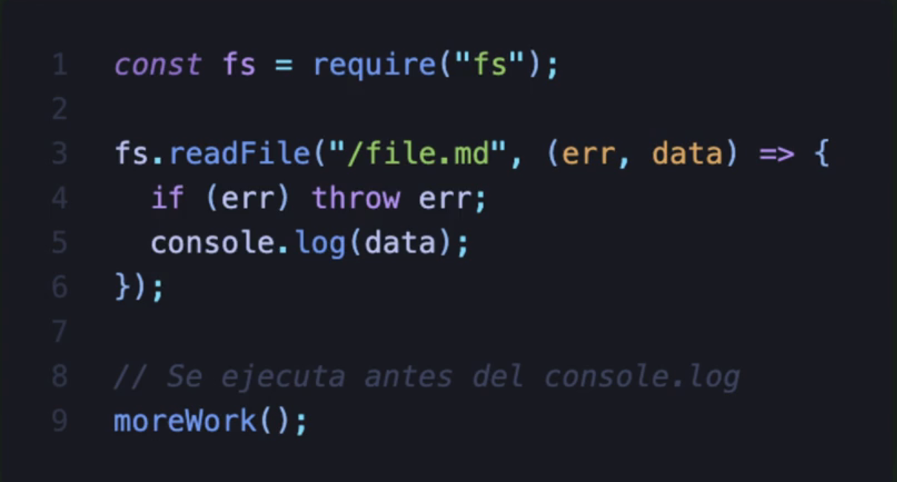

## NODE
- Node es un runtime de JavaScript
- Node nos permite ejecutar JavaScript del lado del servidor
- Está construído sobre el motor V8 de Google Chrome
- Permite la asincronía pese a que Javascript es single threaded (un hilo), NODEJS simula tener múltiples threaded.
- Diseñado para realizar tareas de entrada y salida (I/O) junto con el manejo de archivos.
- I/O: se refiere principalmente a la interacción con el disco duro del sistema o a los procedimientos en los cuales la librería de LIUVI va entrar para que tengamos esta asincronía o se ejecutan en paralelo
- Blocking: es cuando la ejecución de una instrucción debe de esperar a que se complete el proceso para continuar con ejecución de otras instrucciones. Ejemplo:
  
- NODEJS es No bloqueante ó Non-Blocking I/O (cuando estamos ejecutando una instrucción no bloquea el threaded, osea se puede seguir ejecutando otras instrucciones) Ejemplo:la línea de código 6 "moreWork()" se va a ejecutar antes de que termine de leer el archivo "file.md".

- Módulos nativos y módulos de terceros
- Gestión de paquetes con NPM
- Herramienta útil para NODEJS: nvm (node version manager) para manejar múltiples versiones de NODEJS en su ordenador
- Construcción de servidores
- Escalabilidad
- Múltiple plataforma
- Cuenta con 2 millones de paquetes, la imagen de dockerhub se ha descargado más de 1 Billón de veces
- Cuando se instala NODE también instala dos ejecutables: NPM y NPX
- NPM: es el gestor de paquetes
- NPX: nos permite ejecutar ciertos paquetes sin necesidad de instalarlos globalmente en nuestro equipo
- NODE ya viene con varios paquetes precargados, ejemplo: fs (fileSystem)
- Package.json -> archivo que almacena las configuraciones de nuestro proyecto
- Por defecto la importación de módulos en NODE es así: 

- Todo en NODE es un módulo, por lo que cuando importas un archivo es como que se tratáse de un módulo externo, entonces de ese archivo o módulo se debe exportar lo que necesitas para poder ser leído desde afuera.
- El directorio "node_modules" -> contiene todas las dependencias de un proyecto de NODE
- Un proyecto de NODE puede tener dependencias de desarrollo o dependencias de producción (las que llegan a producción)
- Comando para instalar dependencias ó librerías de terceros dentro de nuestro proyecto de NODE: 
- "process" -> es un proceso de NODE que está corriendo y tiene mucha información de la computadora, de los procesos que se están ejecutando, de librerías que se están ejecutando, de variables de entorno, de variables que nosotros enviamos dentro del paquete de variables de entorno, etc.
- El 100% de las herramientas creadas para desarrollar aplicaciones Frontend se basan en NODEJS
